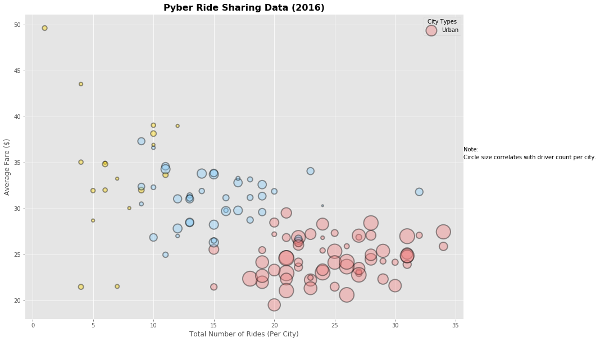
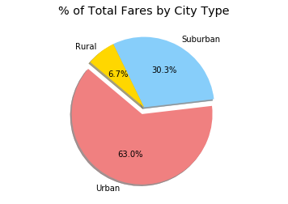
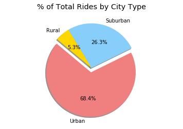
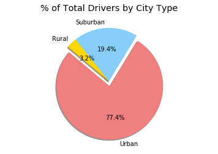
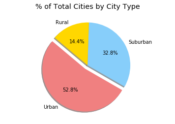

```python
############################
# Importing required files
###########################
import matplotlib.pyplot as plt
#%matplotlib inline
import csv
import pandas as pd
import numpy as np
import random
 
plt.style.use('ggplot')
```


```python
# Read Input files
city_csv = pd.read_csv("city_data.csv") 
ride_csv = pd.read_csv("ride_data.csv") 

print(len(city_csv))
city_csv.head()
 
```

    125


<div>
<style>
    .dataframe thead tr:only-child th {
        text-align: right;
    }

    .dataframe thead th {
        text-align: left;
    }

    .dataframe tbody tr th {
        vertical-align: top;
    }
</style>
<table border="1" class="dataframe">
  <thead>
    <tr style="text-align: right;">
      <th></th>
      <th>city</th>
      <th>driver_count</th>
      <th>type</th>
    </tr>
  </thead>
  <tbody>
    <tr>
      <th>0</th>
      <td>Kelseyland</td>
      <td>0</td>
      <td>Urban</td>
    </tr>
    <tr>
      <th>1</th>
      <td>Nguyenbury</td>
      <td>8</td>
      <td>Urban</td>
    </tr>
    <tr>
      <th>2</th>
      <td>East Douglas</td>
      <td>12</td>
      <td>Urban</td>
    </tr>
    <tr>
      <th>3</th>
      <td>West Dawnfurt</td>
      <td>34</td>
      <td>Urban</td>
    </tr>
    <tr>
      <th>4</th>
      <td>Rodriguezburgh</td>
      <td>52</td>
      <td>Urban</td>
    </tr>
  </tbody>
</table>
</div>


```python
city_csv.loc[city_csv.city == "Alvarezhaven"]
```


<div>
<style>
    .dataframe thead tr:only-child th {
        text-align: right;
    }

    .dataframe thead th {
        text-align: left;
    }

    .dataframe tbody tr th {
        vertical-align: top;
    }
</style>
<table border="1" class="dataframe">
  <thead>
    <tr style="text-align: right;">
      <th></th>
      <th>city</th>
      <th>driver_count</th>
      <th>type</th>
    </tr>
  </thead>
  <tbody>
    <tr>
      <th>65</th>
      <td>Alvarezhaven</td>
      <td>21</td>
      <td>Urban</td>
    </tr>
  </tbody>
</table>
</div>


```python
print(len(ride_csv))
ride_csv.head() 
```

    2375


<div>
<style>
    .dataframe thead tr:only-child th {
        text-align: right;
    }

    .dataframe thead th {
        text-align: left;
    }

    .dataframe tbody tr th {
        vertical-align: top;
    }
</style>
<table border="1" class="dataframe">
  <thead>
    <tr style="text-align: right;">
      <th></th>
      <th>city</th>
      <th>date</th>
      <th>fare</th>
      <th>ride_id</th>
    </tr>
  </thead>
  <tbody>
    <tr>
      <th>0</th>
      <td>Sarabury</td>
      <td>2016-01-16 13:49:27</td>
      <td>38.35</td>
      <td>5403689035038</td>
    </tr>
    <tr>
      <th>1</th>
      <td>South Roy</td>
      <td>2016-01-02 18:42:34</td>
      <td>17.49</td>
      <td>4036272335942</td>
    </tr>
    <tr>
      <th>2</th>
      <td>Wiseborough</td>
      <td>2016-01-21 17:35:29</td>
      <td>44.18</td>
      <td>3645042422587</td>
    </tr>
    <tr>
      <th>3</th>
      <td>Spencertown</td>
      <td>2016-07-31 14:53:22</td>
      <td>6.87</td>
      <td>2242596575892</td>
    </tr>
    <tr>
      <th>4</th>
      <td>Nguyenbury</td>
      <td>2016-07-09 04:42:44</td>
      <td>6.28</td>
      <td>1543057793673</td>
    </tr>
  </tbody>
</table>
</div>


```python
ride_csv.loc[ride_csv.city == "Sarabury"].fare.mean()
```


    23.490000000000002


```python
#merged both the input files to get driver_count and type added to "ride_data.csv"

data_df = pd.merge(ride_csv, city_csv, on="city") # myout.cvs
data_df.head()
#len(data_df) 
```


<div>
<style>
    .dataframe thead tr:only-child th {
        text-align: right;
    }

    .dataframe thead th {
        text-align: left;
    }

    .dataframe tbody tr th {
        vertical-align: top;
    }
</style>
<table border="1" class="dataframe">
  <thead>
    <tr style="text-align: right;">
      <th></th>
      <th>city</th>
      <th>date</th>
      <th>fare</th>
      <th>ride_id</th>
      <th>driver_count</th>
      <th>type</th>
    </tr>
  </thead>
  <tbody>
    <tr>
      <th>0</th>
      <td>Sarabury</td>
      <td>2016-01-16 13:49:27</td>
      <td>38.35</td>
      <td>5403689035038</td>
      <td>46</td>
      <td>Urban</td>
    </tr>
    <tr>
      <th>1</th>
      <td>Sarabury</td>
      <td>2016-07-23 07:42:44</td>
      <td>21.76</td>
      <td>7546681945283</td>
      <td>46</td>
      <td>Urban</td>
    </tr>
    <tr>
      <th>2</th>
      <td>Sarabury</td>
      <td>2016-04-02 04:32:25</td>
      <td>38.03</td>
      <td>4932495851866</td>
      <td>46</td>
      <td>Urban</td>
    </tr>
    <tr>
      <th>3</th>
      <td>Sarabury</td>
      <td>2016-06-23 05:03:41</td>
      <td>26.82</td>
      <td>6711035373406</td>
      <td>46</td>
      <td>Urban</td>
    </tr>
    <tr>
      <th>4</th>
      <td>Sarabury</td>
      <td>2016-09-30 12:48:34</td>
      <td>30.30</td>
      <td>6388737278232</td>
      <td>46</td>
      <td>Urban</td>
    </tr>
  </tbody>
</table>
</div>


```python
my_data_df = city_csv
#my_data_df.head

 
```


```python
# Write CSV in R
my_data_df.to_csv('./myout.csv') 
 
```


```python
x = data_df.groupby('city')['ride_id'].count() 

```


```python
# Total Number of Rides (Per City) for x-axis plot
x = data_df.groupby('city')['ride_id'].count()

# Average Fare($)(per City) for y-axis plot
y = data_df.groupby('city')['fare'].mean()

# Num of drivers (per City) for z-axis (third dimention/3-d for bubble plot) from "city_data.csv"
# z = city_csv['driver_count']*10 # marker size of the bubble 

#z = data_df.groupby('city')['driver_count'].count()
# z
# city_csv.head()
#pd.Series(city_csv['driver_count'])

```


```python
def get_number_of_drivers(city):
    return city_csv.loc[city_csv.city == city].driver_count.values[0]
    
# get_number_of_drivers("Hernandezshire")
def get_city_type(city):
    return city_csv.loc[city_csv.city == city].type.values[0]
get_city_type("Hernandezshire")

def color_schema(x):
    col = ""
    if x=="Urban":
        col = "lightcoral"       
    elif x=="Suburban":
        col = "lightskyblue" 
    elif x=="Rural": 
        col = "gold"
    return col
```


```python
#z = []
#z = [city_csv['city']]
#index = pd.Series(city_csv['city']).values
 
```


```python
#Here I am mapping the city to city to get the correct values for all the driver count, coloring and average
 
z = city_csv['city'].values
 
z = pd.Series(z, index=z).apply(get_number_of_drivers)
city_type = pd.Series(z.index, index=z.index).apply(get_city_type)
color = pd.Series(city_type, index=z.index).apply(color_schema)
new_df = pd.concat([x,y,z,city_type, color], keys=["number_of_rides", "avg_fare", "driver_count", "type", "color"] , axis=1)

# new_df.concat([z], axis=1)
new_df.head()
  
```


<div>
<style>
    .dataframe thead tr:only-child th {
        text-align: right;
    }

    .dataframe thead th {
        text-align: left;
    }

    .dataframe tbody tr th {
        vertical-align: top;
    }
</style>
<table border="1" class="dataframe">
  <thead>
    <tr style="text-align: right;">
      <th></th>
      <th>number_of_rides</th>
      <th>avg_fare</th>
      <th>driver_count</th>
      <th>type</th>
      <th>color</th>
    </tr>
  </thead>
  <tbody>
    <tr>
      <th>Alvarezhaven</th>
      <td>31</td>
      <td>23.928710</td>
      <td>21</td>
      <td>Urban</td>
      <td>lightcoral</td>
    </tr>
    <tr>
      <th>Alyssaberg</th>
      <td>26</td>
      <td>20.609615</td>
      <td>67</td>
      <td>Urban</td>
      <td>lightcoral</td>
    </tr>
    <tr>
      <th>Anitamouth</th>
      <td>9</td>
      <td>37.315556</td>
      <td>16</td>
      <td>Suburban</td>
      <td>lightskyblue</td>
    </tr>
    <tr>
      <th>Antoniomouth</th>
      <td>22</td>
      <td>23.625000</td>
      <td>21</td>
      <td>Urban</td>
      <td>lightcoral</td>
    </tr>
    <tr>
      <th>Aprilchester</th>
      <td>19</td>
      <td>21.981579</td>
      <td>49</td>
      <td>Urban</td>
      <td>lightcoral</td>
    </tr>
  </tbody>
</table>
</div>


```python
z.index
```


    Index(['Kelseyland', 'Nguyenbury', 'East Douglas', 'West Dawnfurt',
           'Rodriguezburgh', 'South Josephville', 'West Sydneyhaven',
           'Travisville', 'Torresshire', 'Lisaville',
           ...
           'Kennethburgh', 'South Joseph', 'Manuelchester', 'Stevensport',
           'North Whitney', 'East Stephen', 'East Leslie', 'Hernandezshire',
           'Horneland', 'West Kevintown'],
          dtype='object', length=125)


```python
# This is my data frame generated with all the above data
#arr = my_data_df['driver_count']
#arr[0:125]
#arr = arr.tolist()
#success = city_csv.groupby('city')

#city_csv['city'].index 
#city_csv.loc[city_csv.city == "Alvarezhaven"] 
#city_csv
```


```python
# Create labels for the X and Y axis in the scatter, 3-d plot (can consider 4 as color is another variation)
fig, ax = plt.subplots(1, 1, figsize=(14, 10))
fig.suptitle
plt.title("Pyber Ride Sharing Data (2016)",fontsize=16, fontweight="bold" )
plt.xlabel("Total Number of Rides (Per City)")
plt.ylabel("Average Fare ($)") 

 
#Trying to create the labels inside the plt with Urban, Suburban, Rural
#Not working, will work on it later, as I have been working very hard on this project for vurning night lamps for days.

# Tell matplotlib to create a scatter plot based upon the above data
#ax.scatter(x=new_df['number_of_rides'], 
#           y=new_df['avg_fare'], 
#           s=new_df['driver_count']*10, 
#           c='lightcoral', 
#           alpha=0.4, linewidths=2, edgecolor="black", label = "Urban")

# Tell matplotlib to create a scatter plot based upon the above data
#ax.scatter(x=new_df['number_of_rides'], 
#           y=new_df['avg_fare'], 
#           s=new_df['driver_count']*10, 
#           c='lightskyblue', 
#           alpha=0.4, linewidths=2, edgecolor="black", label = "Suburban")

# Tell matplotlib to create a scatter plot based upon the above data
#ax.scatter(x=new_df['number_of_rides'], 
#           y=new_df['avg_fare'], 
#           s=new_df['driver_count']*10, 
#           c='gold', 
#           alpha=0.4, linewidths=2, edgecolor="black", label = "Rural")

 
# Tell matplotlib to create a scatter plot based upon the above data
ax.scatter(x=new_df['number_of_rides'], 
           y=new_df['avg_fare'], 
           s=new_df['driver_count']*10, 
           c=new_df['color'], 
           alpha=0.4, linewidths=2, edgecolor="black", label = "Urban")


# Set our legend to where the "Upper right" 
plt.legend(loc="upper right", title="City Types", fancybox=True)

plt.figtext(.90, .54, "Note:", rotation='horizontal')
plt.figtext(.90, .52, "Circle size correlates with driver count per city.", rotation='horizontal')

#plt.xlim(0, 40)
#plt.ylim(15, 55)
 

```


    Text(0.9,0.52,'Circle size correlates with driver count per city.')


```python
# Save and bubble plot
plt.savefig("Pyber_Ride_Sharing.png")
plt.show()

```





```python
################################
# % of Total fares by city type
################################
city_fare = data_df.groupby(['type'])['fare'].sum()
#city_fare.loc['Rural']

total_fare = city_fare.sum()
 
fare_percentage = round(((city_fare/total_fare)*100),2)
 

# Labels for the sections of our pie chart
labels = ["Urban","Suburban", "Rural"]

# The values of each section of the pie chart
sizefare = [fare_percentage['Urban'], fare_percentage['Suburban'], fare_percentage['Rural'] ]

# The colors of each section of the pie chart
colors = ["lightcoral","lightskyblue", "gold"]

# Tells matplotlib to seperate the "Urban" section from the others
explode = (0.1, 0, 0)
 
```


```python
# Creates the pie chart based upon the values above
# Automatically finds the percentages of each part of the pie chart
plt.title('% of Total Fares by City Type')

# Tells matplotlib that we want a pie chart with equal axes
plt.axis("equal")

plt.pie(sizefare, explode=explode, labels=labels, colors=colors, 
        autopct="%1.1f%%", shadow=True, startangle=140)
```


    ([<matplotlib.patches.Wedge at 0x116818208>,
      <matplotlib.patches.Wedge at 0x116818c18>,
      <matplotlib.patches.Wedge at 0x1168216d8>],
     [Text(-0.34391,-1.14966,'Urban'),
      Text(0.527875,0.965064,'Suburban'),
      Text(-0.676864,0.867095,'Rural')],
     [Text(-0.200614,-0.670637,'63.0%'),
      Text(0.287932,0.526398,'30.3%'),
      Text(-0.369199,0.472961,'6.7%')])


```python
# Save and display the chart

plt.savefig("Total_Fares_by_City_Type.png")
plt.show()
```





```python
################################
# % of Total rides per city type
################################
city_ride = data_df.groupby(['type'])['ride_id'].count()

total_ride = city_ride.sum()
 
ride_percentage = round(((city_ride/total_ride)*100),2)
 

# Labels for the sections of our pie chart
labels = ["Urban","Suburban", "Rural"]

# The values of each section of the pie chart
sizeride = [ride_percentage['Urban'], ride_percentage['Suburban'], ride_percentage['Rural'] ]


# The colors of each section of the pie chart
colors = ["lightcoral","lightskyblue", "gold"]

# Tells matplotlib to seperate the "Urban" section from the others
explode = (0.1, 0, 0)
 
```


```python
#city_ride
```


```python
# Creates the pie chart based upon the values above
# Automatically finds the percentages of each part of the pie chart
plt.title('% of Total Rides by City Type')

# Tells matplotlib that we want a pie chart with equal axes
plt.axis("equal")

plt.pie(sizeride, explode=explode, labels=labels, colors=colors, 
        autopct="%1.1f%%", shadow=True, startangle=140)
```


    ([<matplotlib.patches.Wedge at 0x1168bd908>,
      <matplotlib.patches.Wedge at 0x1168c6358>,
      <matplotlib.patches.Wedge at 0x1168c6dd8>],
     [Text(-0.143,-1.19145,'Urban'),
      Text(0.308955,1.05572,'Suburban'),
      Text(-0.71486,0.836048,'Rural')],
     [Text(-0.0834166,-0.695012,'68.4%'),
      Text(0.168521,0.575848,'26.3%'),
      Text(-0.389924,0.456026,'5.3%')])


```python
# Save and display the chart

plt.savefig("Total_Rides_by_City_Type.png")
plt.show()
```





```python
#################################
# % of Total drivers per city type
#################################
 
driver_count = city_csv.groupby(['type'])['driver_count'].sum()

total_drivers = driver_count.loc['Rural'] + driver_count.loc['Suburban'] + driver_count.loc['Urban'] 

 
driver_type_percentage = round(((driver_count/total_drivers)*100),2)
 
# Labels for the sections of our pie chart
labels = ["Urban","Suburban", "Rural"]
 

# The values of each section of the pie chart
sizedriver = [driver_type_percentage.loc['Urban'], driver_type_percentage.loc['Suburban'], driver_type_percentage.loc['Rural'] ]

# The colors of each section of the pie chart
colors = ["lightcoral","lightskyblue", "gold"]

# Tells matplotlib to seperate the "Urban" section from the others
explode = (0.1, 0, 0)
      
```


```python
# Creates the pie chart based upon the values above
# Automatically finds the percentages of each part of the pie chart
plt.title('% of Total Drivers by City Type')

# Tells matplotlib that we want a pie chart with equal axes
plt.axis("equal") 

plt.pie(sizedriver, explode=explode, labels=labels, colors=colors, 
        autopct="%1.1f%%", shadow=True, startangle=140)
```


    ([<matplotlib.patches.Wedge at 0x11696e0f0>,
      <matplotlib.patches.Wedge at 0x11696eb00>,
      <matplotlib.patches.Wedge at 0x1169745c0>],
     [Text(0.195082,-1.18404,'Urban'),
      Text(-0.0703722,1.09775,'Suburban'),
      Text(-0.768421,0.787101,'Rural')],
     [Text(0.113798,-0.690688,'77.4%'),
      Text(-0.0383848,0.598771,'19.4%'),
      Text(-0.419139,0.429328,'3.2%')])


```python
# Save and display the chart

plt.savefig("Total_Drivers_by_City_Type.png")
plt.show()
```





```python
#################################
# % of Total Cities per city type
#################################
city_count = city_csv.groupby(['type'])['driver_count'].count()
total_city_count = city_count.sum()

 
city_type_percentage = round(((city_count/total_city_count)*100),2)
 
# Labels for the sections of our pie chart
labels = ["Urban","Suburban", "Rural"]
 

# The values of each section of the pie chart
sizecity = [city_type_percentage.loc['Urban'], city_type_percentage.loc['Suburban'], city_type_percentage.loc['Rural'] ]

# The colors of each section of the pie chart
colors = ["lightcoral","lightskyblue", "gold"]

# Tells matplotlib to seperate the "Urban" section from the others
explode = (0.1, 0, 0)
      
```


```python
# Creates the pie chart based upon the values above
# Automatically finds the percentages of each part of the pie chart
plt.title('% of Total Cities by City Type')

# Tells matplotlib that we want a pie chart with equal axes
plt.axis("equal")

plt.pie(sizecity, explode=explode, labels=labels, colors=colors, 
        autopct="%1.1f%%", shadow=True, startangle=140)
```


    ([<matplotlib.patches.Wedge at 0x116cfb470>,
      <matplotlib.patches.Wedge at 0x116cfbe80>,
      <matplotlib.patches.Wedge at 0x116d03940>],
     [Text(-0.687605,-0.983463,'Urban'),
      Text(0.960963,0.535304,'Suburban'),
      Text(-0.448813,1.00427,'Rural')],
     [Text(-0.401103,-0.573687,'52.8%'),
      Text(0.524161,0.291984,'32.8%'),
      Text(-0.244807,0.547786,'14.4%')])


```python
# Save and display the chart

plt.savefig("Total_Cities_by_City_Type.png")
plt.show()
```




